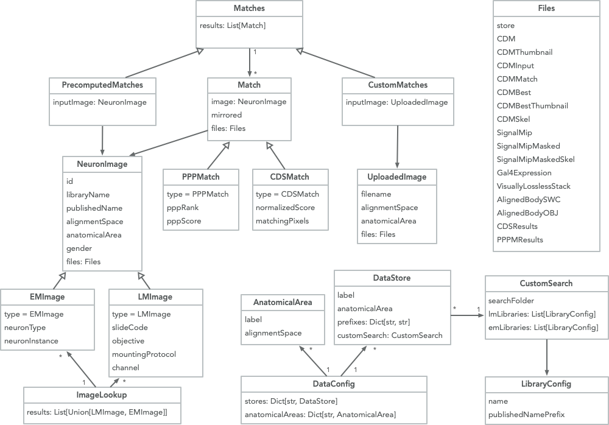

# NeuronBridge Python API

[](https://zenodo.org/badge/latestdoi/479832149)

A Python API for the [NeuronBridge](https://github.com/JaneliaSciComp/neuronbridge) neuron similarity search service.




## Installation

This library is available [on PyPI](https://pypi.org/project/neuronbridge-python/), so you can install it like this:

```bash
pip install neuronbridge-python
```


## Usage

See [this notebook](notebooks/python_api_examples.ipynb) for usage examples.


## Development Notes

Create a new virtual environment and install the dependencies:

    uv venv --python 3.11
    source .venv/bin/activate
    uv pip sync requirements-universal.txt
    uv pip install -e .


### Running data validation using Ray

You can run validation multithreaded on a single machine like this:

    ./neuronbridge/validate_ray.py --dashboard --cores 60

To run the validation script in a distributed manner on the Janelia cluster, you must first install [ray-janelia](https://github.com/JaneliaSciComp/ray-janelia) in a sister directory to where this code base is cloned. Then run a script to bsub the Ray cluster:

    ./scripts/launch_validation.sh


### Updating requirements

After updating the requirements.txt file, you can sync the requirements-universal.txt file like this:

    uv pip compile requirements.txt --universal --output-file  requirements-universal.txt


### Regenerate the JSON schemas:

    python neuronbridge/generate_schemas.py


### Run the unit tests:

    pytest tests


### Publishing a new release

1) Update the version in setup.py
2) Push all changes and tag a release in GitHub
3) Build PyPI distribution:

    python setup.py sdist bdist_wheel

4) Upload to PyPI:

    twine upload dist/*
